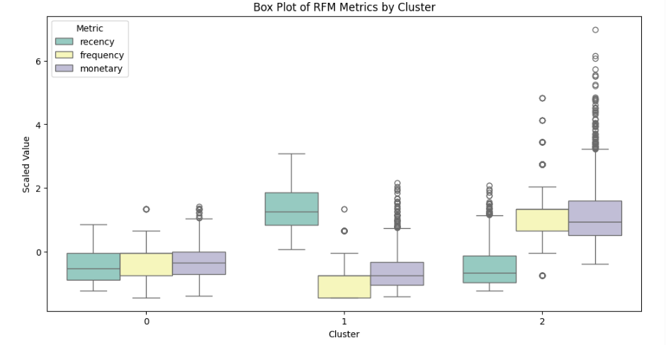
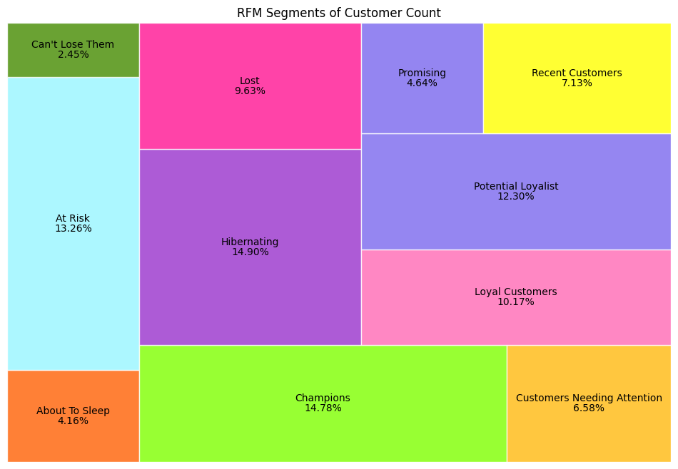

# RFM-Analysis-Quintiles-KMeans-Python

## Task project:

Implement an RFM analysis model for behavior-based customer segmentation using a pizza store dataset, applying two methods:
- RFM with K-Means Clustering
- RFM with Quintile-Based Scoring

## Introduction:
1. Why RFM?
  
  - RFM (Recency, Frequency, Monetary) analysis is a marketing model using customer segmentation based on their transaction history.
  - This model could be very useful, especially for small and medium-sized enterprises (SMEs) with limited marketing resources, helping them focus on the potentially right customer segments to increase ROI, reduce churn, reduce cost, improve customer relationship, and a lot more.

2. How?

- In RFM analysis, customers are scored based on three factors (Recency - how recently, Frequency - how often, Monetary - how much), then labeled based on the combination of RFM scores.

3. Reference:
https://www.putler.com/rfm-analysis

## Dataset:
  The dataset consists of four sheets:
- `orders`: Contains information on 21,350 orders made in 2015, including order ID, date, time, customer ID, and total payment per order.
- `order_details`: Provides detailed information for each order, including the pizza ID and quantity of each pizza ordered.
- `pizzas`: Includes data on each pizza ID, such as pizza type, size, and price.
- `pizza_types`: Describes the name, category, and detailed ingredients of each pizza.
  
## Guideline:
1. Prepare dataset suitable for RFM model.
2. Define and calculate the R, F, and M scores for each customer:
  - `Recency`: Measures how recently a customer made a purchase. 
  - `Frequency`: Measures how often a customer makes a purchase within a specific period, indicating repeat interaction with the business.
  - `Monetary`: Measures the total monetary value spent by the customer, reflecting their overall value to the business.
3. Choose an RFM segmentation approach:
  - If using the Quintile method: Assign a score from 1 to 5 for each RFM metric based on statistical quintiles.
  - If using the K-Means clustering method:
    - Cluster customers using the K-Means algorithm based on their RFM scores.
    - Determine the optimal number of clusters using Silhouette Scores or the Elbow Method.
4. Group customers based on the segmentation tables:
    - Table 1 for RFM-Quintiles
    - Table 2 for RFM-KMeans
5. Visualize the number of segments across different data dimensions.

  

<strong>Figure 1. The segmentation result of RFM-Quintiles</strong>

  

<strong>Figure 2. The segmentation result of RFM-Kmeans</strong>

6. Analyze the current situation of the company and provide insights for the marketing team. (answer below)
7. Recommend which RFM index (R, F, or M) should be prioritized for marketing and sales efforts, especially in the context of a retail model such as the pizza dataset. (answer below)

## **Definition and recommended action for each customer segment:**

<strong>Table 1. The classification table of RFM-Quintiles</strong>

| **Segment**     | **Characteristics**   | **Recommendation**   | 
| ------------- | ------------- | ------------- | 
| Champions |	Bought recently, buy often and spend the most! | Reward them. Can be early adopters for new products. Will promote your brand. |
| Loyal |	Spend good money with us often. Responsive to promotions. |	Upsell higher value products. Ask for reviews. Engage them.
| Potential Loyalist | Recent customers, but spent a good amount and bought more than once. |	Offer membership / loyalty program, recommend other products.
| New customers |	Bought most recently, but not often. | Provide on-boarding support, give them early success, start building relationship.
| Promising |	Recent shoppers, but haven’t spent much. |	Create brand awareness, offer free trials
| Need attention |	Above average recency, frequency and monetary values. May not have bought very recently though. |	Make limited time offers, Recommend based on past purchases. Reactivate them.
| About to sleep |	Below average recency, frequency and monetary values. Will lose them if not reactivated. | Share valuable resources, recommend popular products / renewals at discount, reconnect with them.
| At risk |	Spent big money and purchased often. But long time ago. Need to bring them back! | Send personalized emails to reconnect, offer renewals, provide helpful resources.
| Cannot lose them |	Made biggest purchases, and often. But haven’t returned for a long time. | Win them back via renewals or newer products, don’t lose them to competition, talk to them.
| Hibernating customers |	Last purchase was long back, low spenders and low number of orders. |	Offer other relevant products and special discounts. Recreate brand value.
| Lost customers | Lowest recency, frequency and monetary scores. | Revive interest with reach out campaign, ignore otherwise.

<strong>Table 2. The classification table of RFM-KMeans</strong>

  
| **Segment**     | **Characteristics**   | **Recommendation**   | 
| ------------- | ------------- | ------------- | 
| Cluster 0 |	Purchase some time ago, average frequency, and spending. | Offering personalized communications and loyalty rewards can help strengthen the bond with these customers and increase their long-term value |
| Cluster 1 |	Recent shoppers, low frequency and spending. | Emphasizing customer relationship management to enhance shopping experience and hence strengthen the engagement |
| Cluster 2 |	Frequent and heavy spent shoppers. It has been some time since last transaction. | Figuring out the reasons of leaving. Customized marketing plans encouraging purchase again. |

## Contact

For any questions or feedback, please contact via email: l.vikiet21@gmail.com
